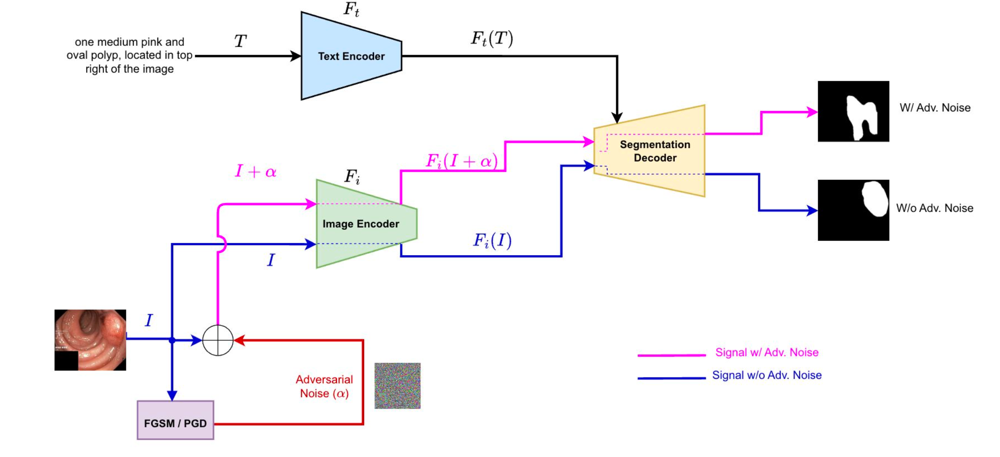
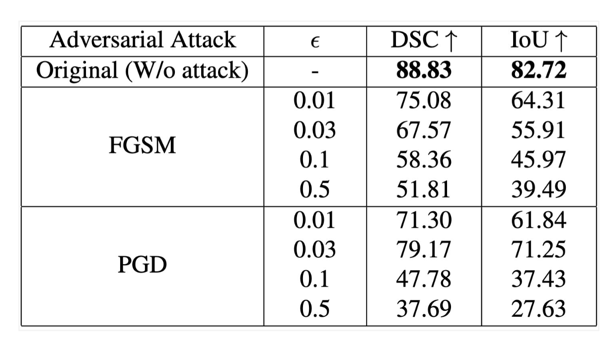

# Fine-Tuning Vision Language Model and Analysis of Robustness Against Adversarial Attack in Medical Image Segmentation 


## Abstract
  Adversarial attacks have been fairly explored for computer vision and vision-language models. However, the avenue of adversarial attack for the vision language segmentation models (VLSMs) is still under-explored, especially for medical image analysis. Thus, we have investigated the robustness of VLSMs against adversarial attacks for 2D medical images with different modalities with radiology, photography, and endoscopy. First, we have fine-tuned pre-trained VLSMs for medical image segmentation with adapters. Then, we have employed adversarial attacks---projected gradient descent (PGD) and fast gradient sign method (FGSM)---on that fine-tuned model to determine its robustness against adversaries. We have reported models' performance decline to analyze the adversaries' impact. The results exhibit significant drops in the DSC and IoU scores after the introduction of these adversaries. 

## Table of Contents
- [Attack Architecture](#methodology)
- [Setup](#setup)
- [Finetuning](#finetuning)
- [Results](#results)

## Attack Architecture
<div style="text-align: center;">
  
</div>

## Setup
Please refer to the [MedVLSM](https://github.com/naamiinepal/medvlsm) repo for environment setup, pretrained model setup and dataset preparation.


## Finetuning

If you need to run our fine-tuning models, you can use the provided script:
```source .venv/bin/activate ```
```bash -x scripts/vlsm_adapter/kvasir_polyp.sh ```

This script will start the fine-tuning process, which is essential for customizing the model for specific tasks. 
In the file, all of the methods have been defined as bash scripts.
<!-- For running inference, please update the defaults configs (such as `ckpt_path`, `models`, etc.) in `scripts/inference.py` to get the evulation metric or generate the output masks (in the original resolution). -->

## Results
<div style="text-align: center;">
  
</div>